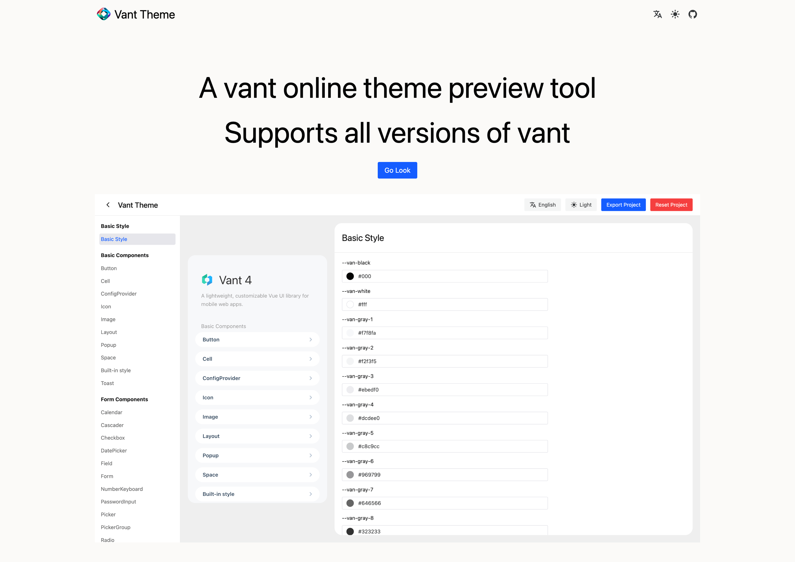
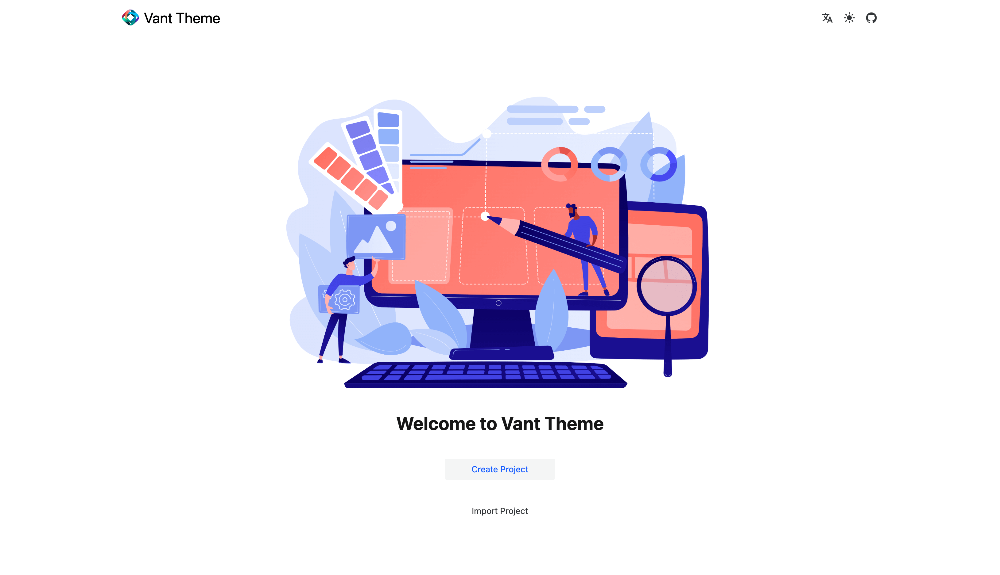
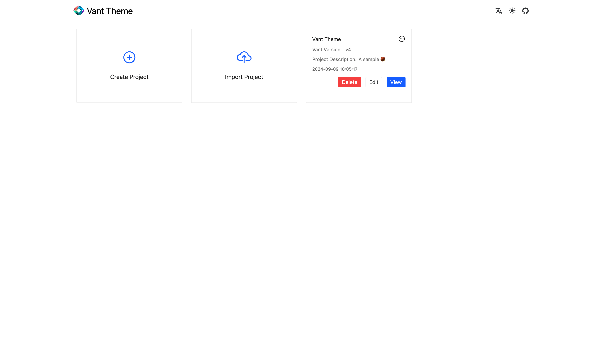
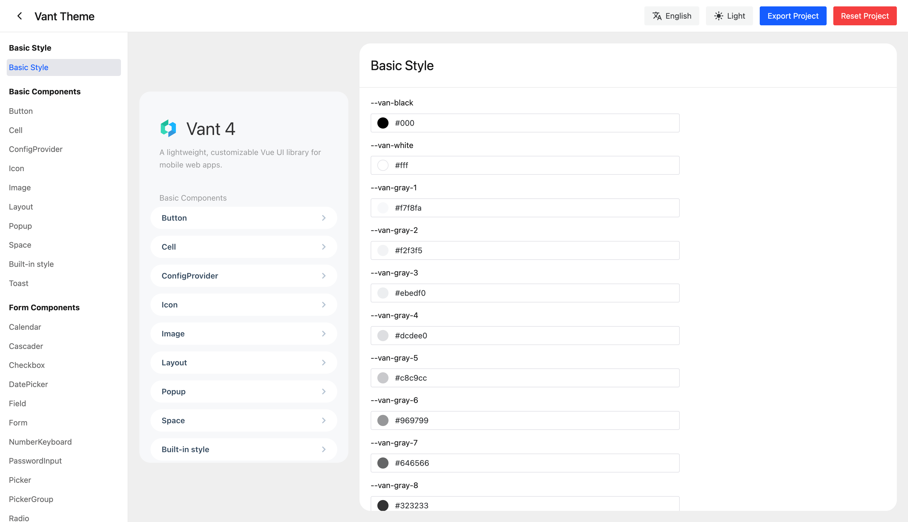
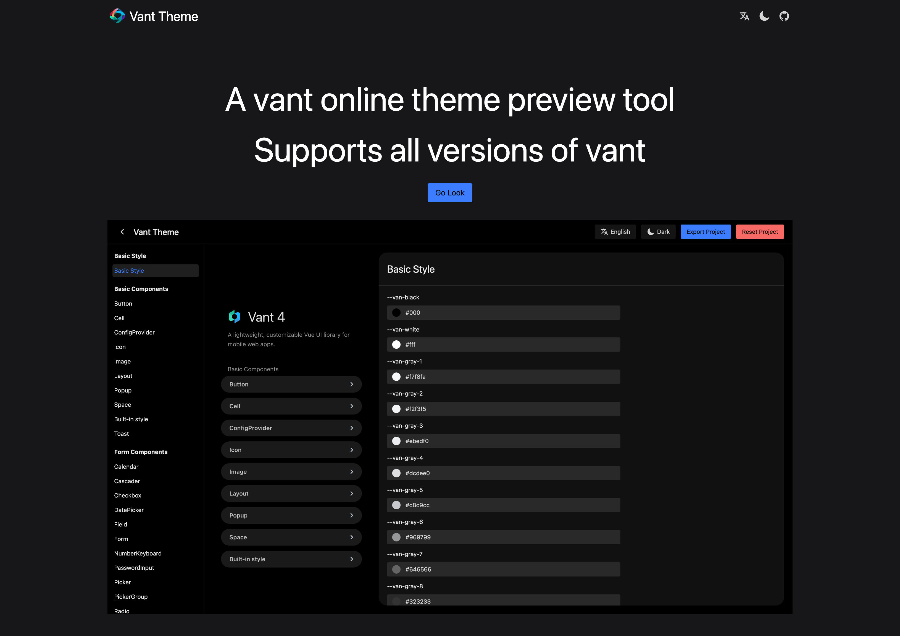
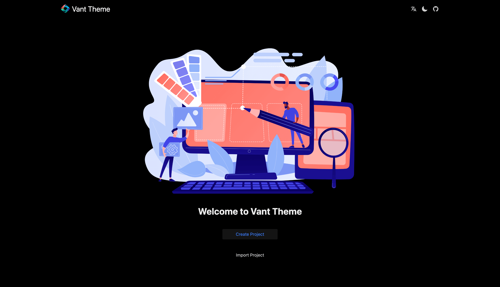
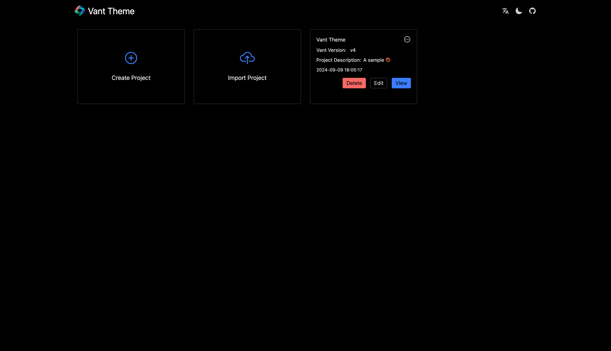
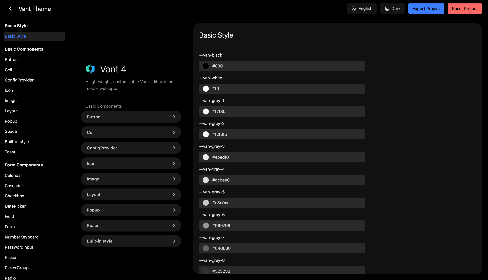

<a href="./README.zh-CN.md">中文介绍</a>

# Introduction

`Vant Theme` is a **online theme preview tool** for [Vant component library](https://vant.pro/vant/#/en-US), **supporting all versions of Vant.**

You can use this tool to preview and customize Vant theme.

`Vant Theme` work through `Vant` provided by **css variables**, it can timely feedback revised.

`Vant 2.x` work through compile `less` .

Online preview：[https://aisen60.github.io/vant-theme](https://aisen60.github.io/vant-theme)

Respository：[https://github.com/Aisen60/vant-theme](https://github.com/Aisen60/vant-theme)

Development of `Vant Theme` tool is to solve the following problems:

* Online quick preview, fast effect feedback, what you see is what you get. You no longer need to repeatedly configure in the editor, you only need to configure the custom component style you need in `Vant Theme`, download it to your local computer and import it.

* You can share it with your company's designer so that he can design components according to the team's design specifications when designing the page. When the designer delivers the design draft, he will also deliver the `Vant Theme` configuration file, which can save some related communication and manpower work.

## Preview

### Light Mode

### Dark Mode

