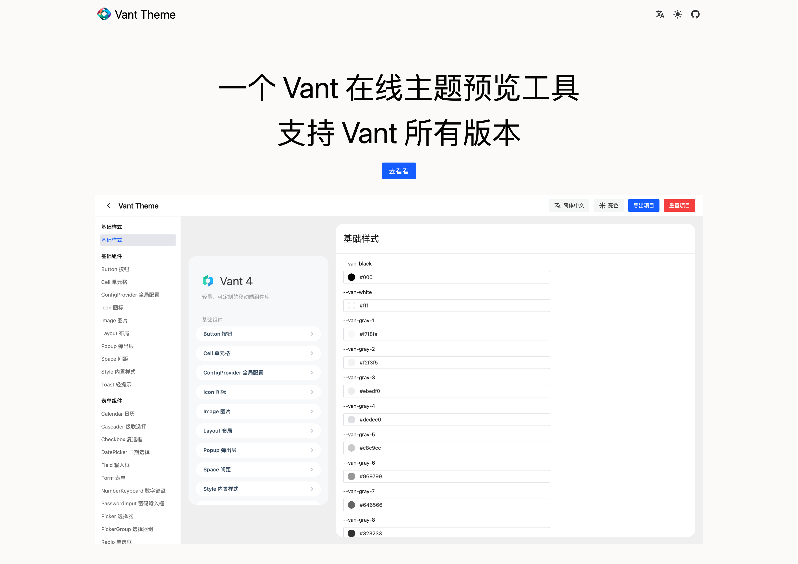
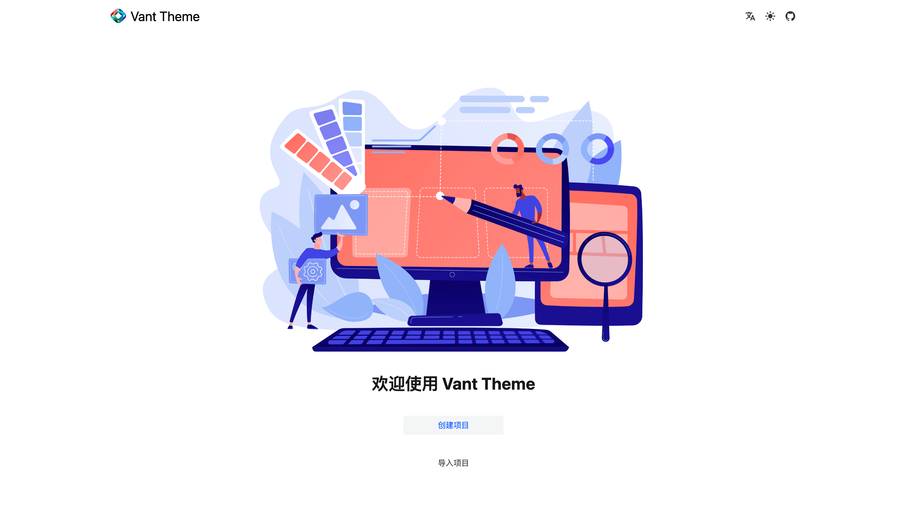
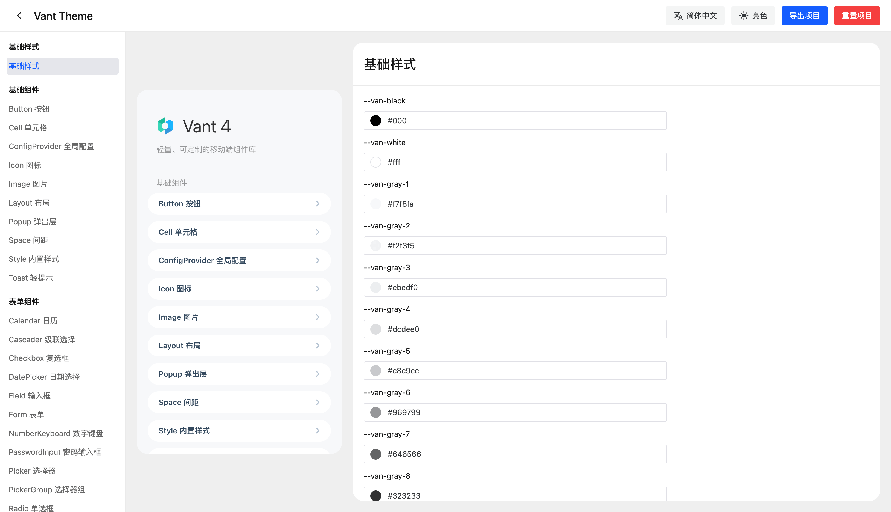
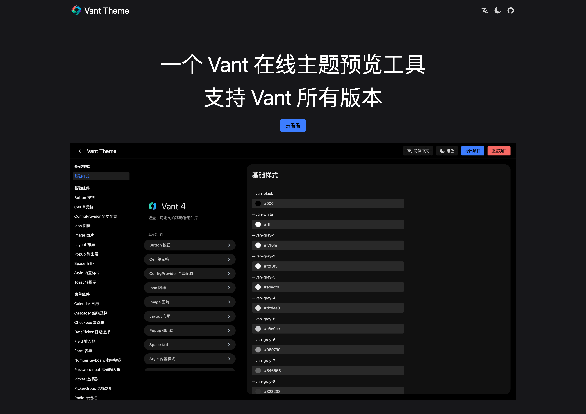
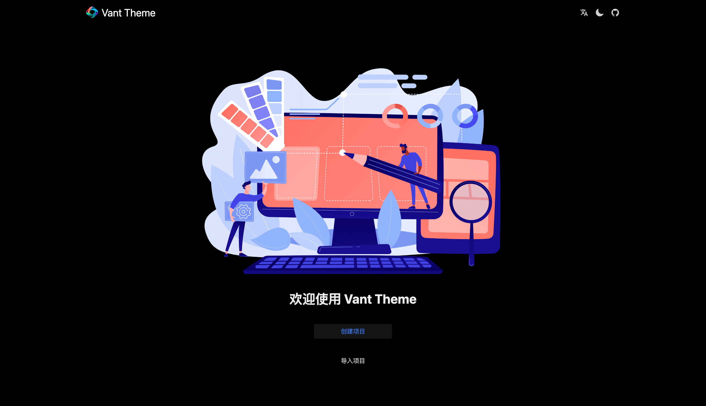
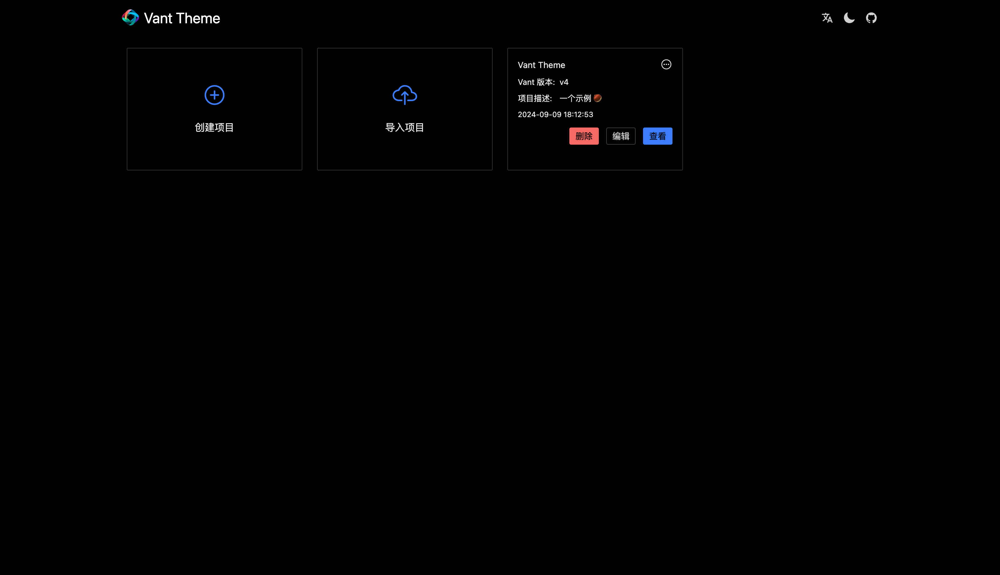
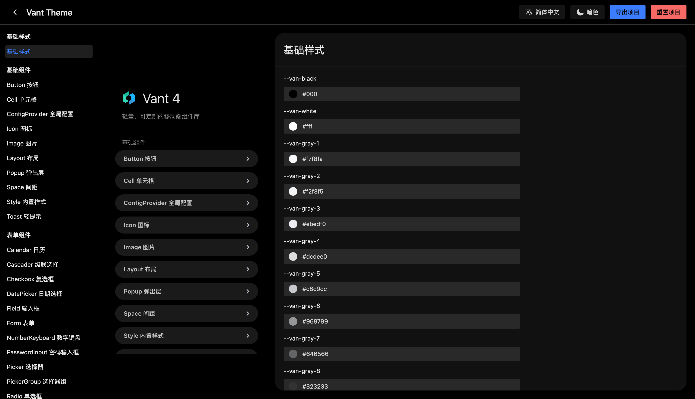

<a href="./README.md">English</a>

# 简介

`Vant Theme` 是一个 `Vant` 组件库**在线主题预览工具**，**支持 `Vant` 所有版本。**

如果你有**定制主题、动态切换主题**的需求，可以使用此工具。

`Vant Theme` 通过 `Vant` 提供的**样式变量**进行修改，它能够及时反馈修改后的样式。

`Vant 2.x` 通过编译 `less` 实现修改后的样式。

在线预览：[https://aisen60.github.io/vant-theme](https://aisen60.github.io/vant-theme)

仓库地址：[https://github.com/Aisen60/vant-theme](https://github.com/Aisen60/vant-theme)

开发 `Vant Theme` 工具的目的，是为了解决以下问题：

* 在线快速预览，快速的效果反馈，所见即所得。你不在需要在编辑器中重复的进行配置，你只需要在 `Vant Theme` 中把你需要自定义组件样式配置好，下载到本地后引入即可。

* 你可以分享给你公司的设计师，让 TA 在设计页面时，能根据团队的设计规范来设计组件。当设计师交付设计稿时，并一同交付 `Vant Theme` 配置文件，可以省去一些相关的沟通和人力工作。

## 预览

## 亮色模式

## 深色模式

